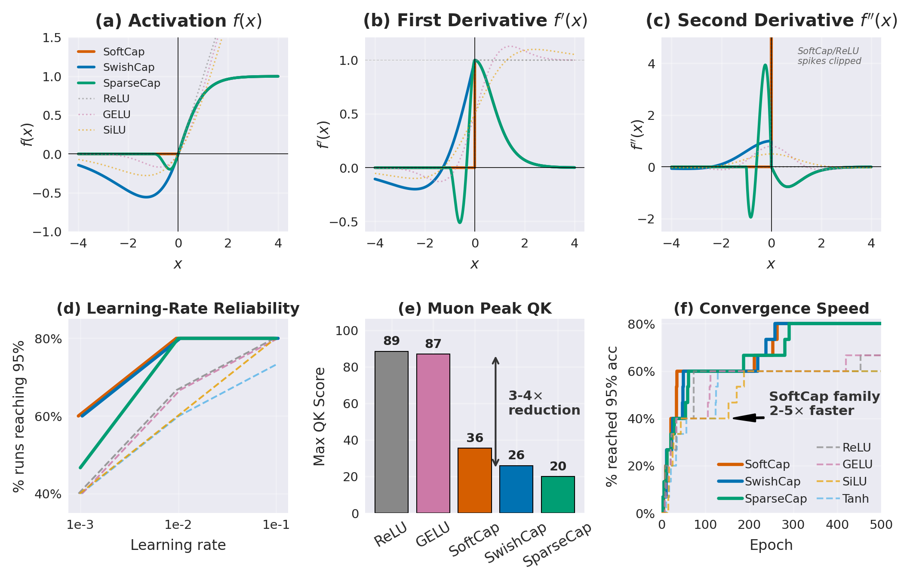

# Beyond ReLU and GELU: SoftCap Bounded Activations for Stability and Sparsity

[](https://www.python.org/downloads/)
[](https://pytorch.org/)
[](LICENSE)



## Abstract

We introduce the **SoftCap family**, bounded rectifying activations derived from explicit continuity and sparsity constraints rather than empirical search [@ramachandran2017searching]. The family comprises **SoftCap** ($C^0$), **SwishCap** ($C^1$), and **SparseCap** ($C^2$), all sharing a bounded positive branch $a\tanh(x)$ with analytically derived, variance-preserving scalar $a^*$ [@glorot2010understanding; @he2015delving; @klambauer2017selu].

In high-learning-rate grokking stress tests, SwishCap achieves 100% survival across all tested rates, whereas hard-zero variants exhibit sharp collapse boundaries, indicating that origin smoothness and negative-side gradient transport govern stability more strongly than boundedness alone [@power2022grokking; @balduzzi2017shattered]. Applied after Q/K projections in Muon-trained ViTs, bounded activations reduce peak pre-softmax attention scores by 3–4×, reducing reliance on explicit clamping [@vaswani2017attention; @dosovitskiy2021vit]. Under heavy-tailed contamination, they suppress outlier logit gaps by over two orders of magnitude, imposing an architectural confidence ceiling without explicit calibration [@ovadia2019can; @guo2017calibration].

While trailing ReLU/GELU by $\approx$4 pp in standard supervised regimes [@nair2010relu; @hendrycks2016gelu], these results establish a constrained design map in which continuity order and notch geometry determine predictable trade-offs across stability, sparsity, and dynamic-range control.

---

## Install

```bash
git clone https://github.com/mr-september/SoftCap.git
cd SoftCap
pip install -r requirements.txt
```

## Quick usage

```python
import torch
from softcap.activations import SoftCap, SwishCap, SparseCap

act = SparseCap(a_init=1.0, learnable=False)
x = torch.randn(32, 128)
y = act(x)
```

## Tests

```bash
pytest tests/
```

## Citation

If you use this work, please cite the preprint (arXiv link forthcoming). The full paper is available as [main.pdf](main.pdf).

## License

MIT. See `LICENSE`.
