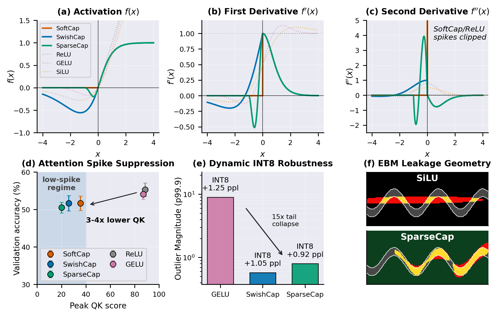

# Designing Bounded Activations: Geometric Control of Neural Network Stability, Sparsity, Quantization, and Energy-Based Models

[](https://www.python.org/downloads/)
[](https://pytorch.org/)
[](https://opensource.org/licenses/Apache-2.0)



## Abstract

We introduce the **SoftCap family**, bounded rectifying activations derived from explicit continuity and sparsity constraints rather than empirical search. The family comprises **SoftCap** ($C^0$), **SwishCap** ($C^1$), and **SparseCap** ($C^2$), all sharing a bounded positive branch $a\tanh(x)$ with analytically derived, variance-preserving scalars $a^*$.

This repository provides the core implementation and experimental suite for the paper. We demonstrate that bounded activations provide geometric control over neural network dynamics, improving stability in high-learning-rate regimes, enhancing robustness to heavy-tailed noise, and providing architectural constraints for quantization and energy-based models.

---

## Install

```bash
git clone https://github.com/mr-september/SoftCap.git
cd SoftCap
pip install -r requirements.txt
```

## PyTorch Implementation & Quick Usage

The canonical PyTorch implementations of the SoftCap family are provided in `softcap/activations.py`.

```python
import torch
from softcap.activations import SoftCap, SwishCap, SparseCap

# Recommended initialization (a*) is derived from variance mapping
from softcap.control_activations import A_STAR_VALUES

act = SparseCap(a_init=A_STAR_VALUES["SparseCap"])
x = torch.randn(32, 128)
y = act(x)
```

## Research Tracks

This repository is organized into several research tracks corresponding to the main experiments in the paper:

- **Grokking & Stability**: Stress-testing continuity and boundedness in high-LR modular arithmetic.
- **OOD Robustness**: Evaluating behavior under heavy-tailed and angular covariate shifts.
- **NLP (NanoGPT)**: Decoder-only transformer scaling with bounded attention projections (Q/K).
- **Robustness Probe**: Testing activation mechanism consistency across objective families (BCE, Hinge, MSE, InfoNCE).
- **Muon-trained ViTs**: Evaluation in high-performance vision transformers.

To run the experiments:

```bash
# Run a quick smoke test for all main experiments
python scripts/run_paper_experiments.py all-main --profile quick

# Run full paper reproduction (requires GPU)
python scripts/run_paper_experiments.py all-main --profile paper
```

## Tests

```bash
pytest tests/
```

## Citation

If you use this work, please cite the preprint:

**Cai, L., & Tang, J. (2026). Designing Bounded Activations: Geometric Control of Neural Network Stability, Sparsity, Quantization, and Energy-Based Models. Zenodo. https://doi.org/10.5281/zenodo.18829082**

```bibtex
@article{cai2026designing,
  title={Designing Bounded Activations: Geometric Control of Neural Network Stability, Sparsity, Quantization, and Energy-Based Models},
  author={Cai, Larry and Tang, Jie},
  journal={Zenodo},
  year={2026},
  doi={10.5281/zenodo.18829082},
  url={https://doi.org/10.5281/zenodo.18829082}
}
```

## License

Apache 2.0. See [LICENSE](LICENSE).
